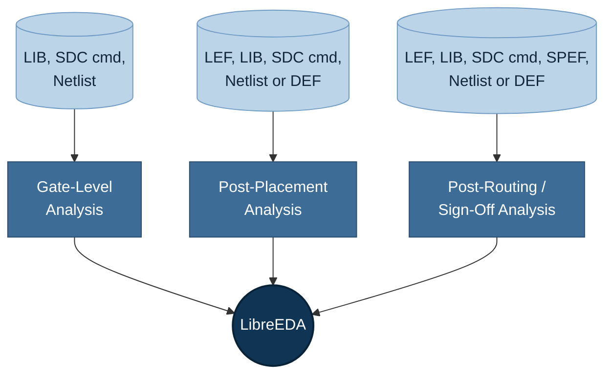

# LibreEDA

A static timing analysis (STA) engine for open-source EDA flows.

[](https://github.com/Circuits-and-Systems-Lab-CASlab/LibreEDA#)

## Overview

LibreEDA evaluates the timing behavior of a digital circuit. The tool computes signal propagation delays, setup and hold times, and other timing constraints, to verify that a design meets its timing requirements.

## Analysis Modes and Required Files



| Mode                             | Required Files                      | Functionality                                         |
| -------------------------------- | ----------------------------------- | ----------------------------------------------------- |
| Gate-Level Analysis              | LIB, SDC, Netlist                   | Fast, gate delay only, no wire delay or physical info |
| Post-Placement Analysis          | LEF, LIB, SDC, Netlist or DEF       | Gate and wire delay, based on physical placement      |
| Post-Routing / Sign-Off Analysis | LEF, LIB, SDC, SPEF, Netlist or DEF | Uses extracted parasitics (Detailed RC)               |

## Supported PDKs

> TBD — validated PDKs will be listed here once confirmed for this release.

The automated testcase suite ships with two PDKs used for the staged design flow:

- **`sky130hs`** — vendored directly (~70MB, TT-corner Liberty + tech/merged LEF). Nothing extra to fetch.
- **`asap7`** — pulled in on demand as a git submodule via `make pdk-asap7` (see [Automated Testcases](#automated-testcases)).

---

# Getting Started

LibreEDA can be built and run either **locally on Ubuntu 24.04 LTS** or inside a **Docker container**. Choose whichever fits your environment.

- [Option A — Local setup &amp; execution](#option-a--local-setup--execution)
- [Option B — Docker environment](#option-b--docker-environment)

---

## Option A — Local Setup & Execution

Instructions for setting up the environment and running **LibreEDA** locally on **Ubuntu 24.04 LTS**.

> **Note**: Official pre-compiled binaries are available for **Ubuntu 24.04**. Additional support for **other Linux distributions** is available upon request.

### Requirements & System Dependencies

LibreEDA relies on specific system libraries, compilers (GCC 11), GTK/VTE GUI toolkits, and scientific computing development headers (GSL, SuiteSparse, FFTW).

#### System Package Overview

Running the dependency script automatically installs and configures:

* **Compilers & Build Tools:** `gcc-11`, `g++-11`, `build-essential`, `cmake`, `pkg-config`, `flex`, `bison`
* **GUI & Terminal Libraries:** `libgtk2.0-dev`, `libvte-dev` *(built automatically from source if unavailable)*
* **Scientific & Math Libraries:** `libgsl-dev`, `libsuitesparse-dev`, `libfftw3-dev`, `gnuplot`
* **Scripting & Runtimes:** `tcl8.6`, `tcl8.6-dev`, `python3`
* **System Utilities:** `zlib1g-dev`, `libreadline-dev`, `libx11-dev`, `libncurses-dev`, `libssl-dev`, `libffi-dev`, `libsqlite3-dev`, `tk-dev`, `libgdbm-dev`, `libc6-dev`, `libbz2-dev`

### Quick Installation

Setting up the entire environment is automated through the provided script.

#### 1. Make the Installer Executable

Open your terminal in the directory containing `install_dependencies.sh` and make it executable:

```bash
chmod +x install_dependencies.sh
```

#### 2. Run the Dependency Installer

Execute the installation script:

```bash
./install_dependencies.sh
```

*(If prompted, enter your `sudo` password to allow package installation and system library updates).*

**What the script handles automatically:**

1. Detects and installs any missing APT packages.
2. Configures `gcc-11` and `g++-11` as your active default system compilers via `update-alternatives`.
3. Handles `libvte-dev` installation—either via APT or by downloading and compiling VTE `0.28.2` from source inside `~/vte-build`.
4. Copies necessary Tcl headers into `/usr/include/` if needed.

### Running LibreEDA

Once the installer outputs `=== Environment Ready ===`, your local system is configured to launch the LibreEDA executable directly:

```bash
./Tool/build/LibreEDA
```

### Troubleshooting

* **Permission Denied when running installer:** Ensure you ran `chmod +x install_dependencies.sh`.
* **GUI Display Issues:** If running via SSH, Distrobox, or WSL, ensure X11 forwarding is configured properly and active on your host machine.
* **Compiler Mismatch:** Verify `gcc-11` is active by running:

```bash
gcc --version
```

---

## Option B — Docker Environment

Configuration and Makefile required to build and run the **LibreEDA** tool inside a containerized **Ubuntu 24.04** environment with GUI support (X11 forwarding) and customizable volume mounts.

### Prerequisites

* **Docker Engine** installed and active.
* **X11 display server** on your host system (for GUI rendering).
* Grant container access to your local display server:
  ```bash
  xhost +local:root
  ```

### Environment & Path Mapping

When running the container, host directories are automatically mapped into the container environment:

| Host Path                                  | Container Path     | Description                                                             |
| ------------------------------------------ | ------------------ | ----------------------------------------------------------------------- |
| `${PWD}/../` *(Default Top Directory)* | `/home/LibreEDA-Project`  | **Primary Workspace:** Source code, scripts, and build artifacts. |
| `/tmp/.X11-unix`                         | `/tmp/.X11-unix` | **X11 Socket:** Forwards GUI applications to host display.        |
| *(User Defined)*                         | *(Custom)*       | Dynamic volume mounts for PDKs, technology files, or external libs.     |

### Quick Start

#### 1. Navigate to the Docker Directory

```bash
cd <path_to_docker_folder>
```

#### 2. Build the Docker Image

Build the local `libreeda_docker_ubuntu24:v1` Docker image:

```bash
make build-docker
```

#### 3. Run and Enter the Container

Start the container in background mode and attach an interactive `/bin/bash` terminal session:

```bash
make run
```

Once inside, your workspace will be located at `/home/LibreEDA-Project`.

### Advanced Execution Options

#### Mount External PDKs or Technology Libraries

Pass extra directory mappings into the container using `EXTRA_PATHS` during execution:

```bash
make run EXTRA_PATHS="-v /path/to/pdk:/pdk -v /path/to/libs:/libs"
```

#### Override Default Root Workspace Path

By default, the root directory is `${PWD}/../`. If your project root is located elsewhere:

```bash
make run LIBREEDA_ROOT_PATH=/absolute/path/to/LibreEDA
```

### Management Commands Reference

| Command               | Action                  | Description                                                                  |
| --------------------- | ----------------------- | ---------------------------------------------------------------------------- |
| `make build-docker` | **Build**         | Builds the Docker image (`libreeda_docker_ubuntu24:v1`).                    |
| `make run`          | **Run & Connect** | Starts the container in background and launches an interactive bash shell.   |
| `make sh`           | **New Terminal**  | Opens an additional terminal session inside the running container.           |
| `make stop`         | **Stop**          | Stops and deletes the running container instance.                            |
| `make down`         | **Stop**          | Alias for`make stop`.                                                      |
| `make save`         | **Export Image**  | Archives and compresses the image into`libreeda_docker_ubuntu24.v1.tar.gz`. |
| `make load`         | **Import Image**  | Loads the Docker image from`libreeda_docker_ubuntu24.v1.tar.gz`.            |

---

# Automated Testcases

[`Automated-Testcases/`](Automated-Testcases/) is a Makefile-driven regression suite and design-flow template for LibreEDA: a small CI test suite with no dependencies beyond the binary, plus example designs (`aes` on both `asap7` and `sky130hs`) you can run the full load/placement/timing flow against.

## Running the Test Suite

### 1. Build LibreEDA

Follow [Option A](#option-a--local-setup--execution) or [Option B](#option-b--docker-environment) above first, so you have a working binary.

### 2. Point LIBREEDA_ROOT at your build

```bash
cd Automated-Testcases
export LIBREEDA_ROOT=../Tool/build   # wherever your build actually is
```

### 3. Run the suite

```bash
make test
```

Each test loads a tiny synthetic design and diffs the output against a checked-in golden file:

```
PASS: load_lef
PASS: load_lib
PASS: load_verilog
PASS: report_timing_basic
```

That's it — no PDK needed for this part. Leaving `LIBREEDA_ROOT` unset fails immediately with a clear error instead of a confusing "file not found" further down. To add a new test, drop a `<name>.tcl` into `tests/`, then run `make regen-<name>` once you've checked its output by hand.

## Variables Reference

Every target is `make <target> [VAR=value ...]`, run from inside `Automated-Testcases/`:

| Variable          | Default                                                                                | Used by                                                                                                               | What it does                                                                                            |
| ----------------- | -------------------------------------------------------------------------------------- | --------------------------------------------------------------------------------------------------------------------- | ------------------------------------------------------------------------------------------------------- |
| `LIBREEDA_ROOT`  | none -- falls back to`$LibreEDA_INSTALL_DIR` if that's set, otherwise errors          | anything that runs the tool (`test`, `regen-%`, `load`, `report_timing`, `floorplan`, `global_placement`) | Path to your LibreEDA build.                                                                     |
| `LIBREEDA_BIN`   | auto-detected: `$LIBREEDA_ROOT/LibreEDA`, falling back to `$LIBREEDA_ROOT/ThesSTA` or `$LIBREEDA_ROOT/pathviz` (older build names), whichever exists | same as above                                                                                                         | Override if your build uses some other binary name.                                                     |
| `DESIGN_CONFIG` | `Designs/aes_sky130hs/config.mk`                                                     | `load`, `report_timing`, `floorplan`, `global_placement`, `*-script`                                        | Which`Designs/*/config.mk` to use -- picks both the design and its platform.                          |
| `PDK_ROOT`      | `./PDK`                                                                              | design-flow targets                                                                                                   | Where to find`PDK/<platform>/` on disk.                                                               |
| `TIMING_DRIVEN` | unset                                                                                  | `global_placement`                                                                                                  | `=1` pulls in Liberty and passes `-timing_driven`.                                                  |
| `INTERACTIVE`   | unset                                                                                  | design-flow targets                                                                                                   | `=1` drops to the tool's prompt instead of exiting at the end. Needs a real terminal.                 |
| `GUI`           | unset                                                                                  | design-flow targets                                                                                                   | `=1` opens the GUI (`show_gui`) before handing back control. Needs a real terminal (and a display). |
| `RESULTS_DIR`   | `results/<platform>/<design>`                                                        | design-flow targets,`*-script` targets                                                                              | Where composed driver scripts and`*-script` output land.                                              |
| `LOG_DIR`       | `logs/<platform>/<design>`                                                           | design-flow targets                                                                                                   | Where run logs land.                                                                                    |
| `REPORTS_DIR`   | `reports/<platform>/<design>`                                                        | `report_timing`                                                                                                     | Where the copied`.rpt` file lands.                                                                    |

`make help` (run from `Automated-Testcases/`) prints this same information plus the full target list straight from the Makefile, so it never goes stale.

## PDK Setup

Two platforms are supported; only `sky130hs` works out of the box.

- **`sky130hs`** — vendored directly (~70MB: TT-corner Liberty + tech/merged LEF), nothing to fetch.
- **`asap7`** — the full [asap7sc7p5t_28](https://github.com/The-OpenROAD-Project/asap7sc7p5t_28) repo (the official ASAP7 standard-cell/LEF/LIB source) is tens of GB with CCS libs, GDS, and Vt/corner combinations this repo doesn't use, so it's pulled in as a git submodule instead of vendored directly. Plain `git submodule update --init` would still check out the *entire* repo, and its Liberty files ship as `.lib.7z` archives rather than raw `.lib`, so use the fetch script instead:

  ```bash
  cd Automated-Testcases
  make pdk-asap7
  ```

  This does a partial + sparse clone of just the 4x-scaled LEFs, the 4x tech LEF, and the TT-corner NLDM Liberty archives (~50MB instead of tens of GB), then extracts the `.lib.7z` files and deletes the archives.

  Safe to re-run any time — it reapplies the same sparse-checkout patterns and won't re-download files it already has. Running a design-flow target against `asap7` before fetching fails fast with a clear message telling you to run `make pdk-asap7`, instead of a confusing error deep in a Tcl script.

## Running the Design Flow

Each target composes only the Tcl stages it actually needs into a throwaway driver script and runs it through LibreEDA. Logs land in `logs/<platform>/<design>/`, and `report_timing` also drops a copy of its report into `reports/<platform>/<design>/`.

| Flow                      | Stages run                                                                             | Example                                                               |
| ------------------------- | -------------------------------------------------------------------------------------- | --------------------------------------------------------------------- |
| `make load`             | `load_lef` → `load_design`                                                        | `make load`                                                         |
| `make report_timing`    | `load_lef` → `load_lib` → `load_design` → `report_timing`                   | `make report_timing DESIGN_CONFIG=Designs/aes_cipher_top/config.mk` |
| `make floorplan`        | `load_lef` → `load_design` → `floorplan`                                       | `make floorplan`                                                    |
| `make global_placement` | `load_lef` → [`load_lib`] → `load_design` → `floorplan` → `global_place` | `make global_placement TIMING_DRIVEN=1`                             |

`load_lib` in `global_placement`'s stage list only runs when `TIMING_DRIVEN=1` is set -- without it, placement runs with no timing data at all.

### Picking a Design and Platform

Two designs ship, both the same `aes_cipher_top` RTL synthesized against different platforms:

| Design                     | Platform     | Netlist source                                                    |
| -------------------------- | ------------ | ----------------------------------------------------------------- |
| `Designs/aes_cipher_top` | `asap7`    | gate-level netlist provided directly, includes scan (`SE` port) |
| `Designs/aes_sky130hs`   | `sky130hs` | Yosys post-synthesis netlist, mapped to sky130hs cells            |

Select one with `DESIGN_CONFIG=Designs/<name>/config.mk` on any flow above -- see the `report_timing` example in the table. A design is just a `config.mk` pointing at a Verilog netlist, an SDC file, a platform name, and floorplan parameters — add a new one by creating `Designs/<name>/config.mk` alongside its netlist/SDC. The platform comes from `PLATFORM` inside that file, not a separate flag; a platform is a pair of stage scripts under `flows/platforms/<name>/` (`load_lef.tcl`, `load_lib.tcl`) — add a new one the same way.

> LibreEDA's `all_inputs`/`all_outputs` ignore all flags (including `-no_clocks`) and always return every port of that direction, clock included. Both designs' SDC files work around this by listing every input/output port explicitly instead of relying on `all_inputs -no_clocks`.

### Interactive and GUI Modes

```bash
make report_timing INTERACTIVE=1   # drop to the tool's prompt instead of exiting
make report_timing GUI=1           # open the GUI (show_gui) first
```

Both need a real terminal attached — don't run these in a background/piped shell.

### Generating the Tcl Script Without Running It

```bash
make report_timing-script          # writes results/<platform>/<design>/report_timing.tcl
```

Every flow target has a `-script` counterpart (`load-script`, `floorplan-script`, `global_placement-script`, `report_timing-script`) that writes the composed driver script instead of running it — useful for inspecting exactly what a target does or handing it to someone without the Makefile. Run it later with your build's binary directly, e.g. `LibreEDA -no_gui -f results/<platform>/<design>/report_timing.tcl`, from inside `Automated-Testcases/`.

### Cleaning Up

```bash
make clean        # removes test-suite results and all design-flow output dirs
make clean_run     # removes only the design-flow output dirs (results/logs/reports)
```

## Directory Layout

```
Automated-Testcases/
  testcase-data/       tiny synthetic LEF/LIB/Verilog fixtures used by make test
  tests/                <name>.tcl + <name>.ok golden files for make test
  normalize_log.sh       makes LibreEDA output diffable/portable across machines

  flows/
    platforms/asap7/      load_lef.tcl, load_lib.tcl for the ASAP7 PDK
    platforms/sky130hs/   load_lef.tcl, load_lib.tcl for the sky130hs PDK
    stages/                load_design, floorplan, global_place, report_timing, finish

  Designs/aes_cipher_top/  aes on asap7: netlist, SDC, config.mk
  Designs/aes_sky130hs/    aes on sky130hs: netlist, SDC, config.mk

  PDK/ASAP7/               git submodule, fetched via `make pdk-asap7`
  PDK/sky130hs/             vendored directly: tech/merged LEF + TT-corner Liberty

  fetch_asap7_pdk.sh       sparse-fetches + extracts just the ASAP7 files above
  load_aes.tcl             standalone quick-load script, no Makefile needed
```

## Known Limitations

- LibreEDA has no persistent design database between stages (`save_def` won't write until placement exists), so every target reloads the PDK and design from scratch rather than checkpointing between stages.
- Only `load`, `report_timing`, `floorplan`, and `global_placement` stages exist so far — no `place`/`route`/`cts` yet. This will be updated soon as more stages land.

---

## Documentation

Full API and TCL command reference: TBD (link to be added once published).

## Contributing

Contribution guidelines: TBD.

## License

Released under the [BSD-3-Clause license](https://github.com/Circuits-and-Systems-Lab-CASlab/LibreEDA#). The automated testcase suite is part of the parent repository; see [`../LICENSE`](../LICENSE).

## Acknowledgments

LibreEDA is developed and maintained by the University of Thessaly's [Circuits and Systems (CAS) Lab](https://caslab.e-ce.uth.gr/). Its enhancement is supported by the [Chips Joint Undertaking (Chips JU)](https://www.chips-ju.europa.eu/), under grant agreement GAP-101252715 ([ODE4EC-DIG](https://github.com/ODE4EC/ode4ec.eu)).

<p align="center">
  <a href="https://caslab.e-ce.uth.gr/"></a>
      
  <a href="https://caslab.e-ce.uth.gr/RnDprojects.html"></a>
</p>

## Support

For questions or issues, please open a GitHub issue. Additional contact details: TBD.
